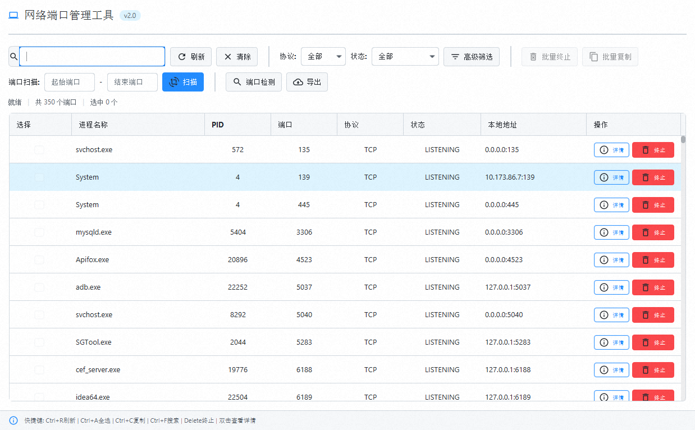

<p align="center">
  
</p>
<h2 align="center">网络端口管理工具</h2>

<p align="center">
  一个轻量、高效、现代化的端口监控与进程管理工具
</p>
<p align="center">
  
  
  
</p>

---

## 🚀 项目简介

**网络端口管理工具（network-port-tools）** 是一款基于 JavaFX 开发的跨平台桌面应用，  
用于帮助开发者、运维人员快速查看系统端口占用情况，并对进程进行高效管理。

在日常开发中，经常会遇到：

* ❓ 端口被占用却不知道是谁
* ❓ 服务启动失败（Address already in use）
* ❓ 查端口需要频繁使用命令行

👉 本工具通过 **可视化界面 + 实时数据 + 一键操作**，  
让端口管理变得简单直观。

---

## ⚠️ 为什么需要它

常见痛点：

* 🔥 端口被占用却找不到进程
* 🧩 `netstat / lsof` 命令繁琐
* 🐢 手动排查效率低
* 💣 杀错进程导致系统异常

👉 一个可视化工具，可以节省你大量时间。

---

## 🔗 项目地址

**Gitee 地址：** https://gitee.com/lxwise/network-port-tools 

**Github 地址：** https://github.com/lxwise/network-port-tools

---

## :star::star::star: Star

如果这个工具帮你节省了哪怕 1 分钟排查时间：

👉 请给个 **Star ⭐**

你的支持会让项目持续迭代优化，也欢迎：

* 提 Issue 🐛
* 提 PR 🚀
* 一起完善功能 💡

---

## :dash::dash::dash: 下载安装

可以在 Github Releases 下载：

支持：

* exe / msi（Windows）
* dmg（macOS）
* rpm / deb（Linux）
* jar（通用）

---

### 🛠 下载地址

👉 https://github.com/lxwise/network-port-tools/releases

---

### 🛠 安装方式

### ✅ Windows

下载：

* `network-port-tools.exe`
* `network-port-tools.msi`

双击安装或直接运行

---

### 🍎 macOS

下载：

* `network-port-tools.dmg`

或：

```bash
java -jar network-port-tools.jar
```

### 🐧 Linux

下载：

- .rpm 或 .deb

或：

```bash
java -jar network-port-tools.jar
```

💦 通用方式
```bash
java -jar network-port-tools.jar
```

## ✨ 核心功能

### 🔍 端口监控

- 实时查看系统端口占用情况
- 支持 TCP / UDP
- 显示进程名称 + PID


### ⚡ 智能搜索

- 支持端口 / 进程名 / PID 搜索
- 实时过滤
- 快速定位问题进程


### 🎯 端口扫描

- 指定端口范围扫描
- 快速检测开放端口
- 支持批量分析

### 💀 进程管理

- 一键终止占用端口的进程
- 批量终止（多选）
- 安全提示避免误操作

### 📊 数据操作
- 复制端口信息
- 导出 CSV
- 批量处理

### ⌨ 快捷键支持
- Ctrl + R 刷新
- Ctrl + F 搜索
- Ctrl + A 全选
- Delete 终止进程

## 🧠 设计理念

> 提高效率，而不是增加负担

本工具强调：

- ✅ 极简操作（减少命令行依赖）
- ✅ 快速定位问题
- ✅ 安全可控（避免误杀系统进程）


## 🛠 技术栈

- Java 25
- JavaFX 25
- AtlantaFX（现代 UI）
- Ikonli 图标库
- Hutool 工具库
- SLF4J + Logback

## 🛫️ 起飞
功能 截图


## 📌 注意事项
- ⚠ 某些进程需要 管理员权限 才能终止
- ⚠ 请勿终止系统关键进程
- ⚠ 大范围端口扫描可能较慢

## ❤️ 支持
如果你觉得这个项目对你有帮助：
👉 点个 Star ⭐ 支持一下作者！


## 📄 License
Apache License 2.0